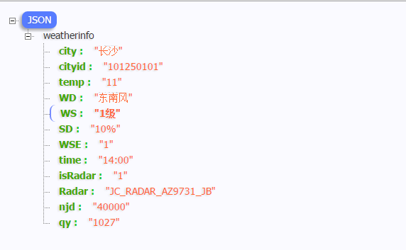

 近来 一直收集一些好用的公共接口 如天气  快递 等等  在这里留个备份
	
	
 #### 中国天气网 天气接口 返回的都是json数据

 [china_weather_changsha](http://www.weather.com.cn/data/sk/101250101.html)

 示例链接 

 `
 http://www.weather.com.cn/data/sk/101250101.html
 `

 

 #### 百度的api 天气接口  返回的同样也是json数据

 [baidu_changsha](http://api.map.baidu.com/telematics/v3/weather?location=%E9%95%BF%E6%B2%99&output=json&ak=640f3985a6437dad8135dae98d775a09)
 
 `http://api.map.baidu.com/telematics/v3/weather?location=%E9%95%BF%E6%B2%99&output=json&ak=640f3985a6437dad8135dae98d775a09
 ` 

中国天气网 城市列表文件、天气图标和其他资源文件

##### apk assets 文件列表 

##### 城市代码文件 

##### 特殊天气提示语 

相关文件下载：[weather_res.rar](../files/weather_res.rar)

