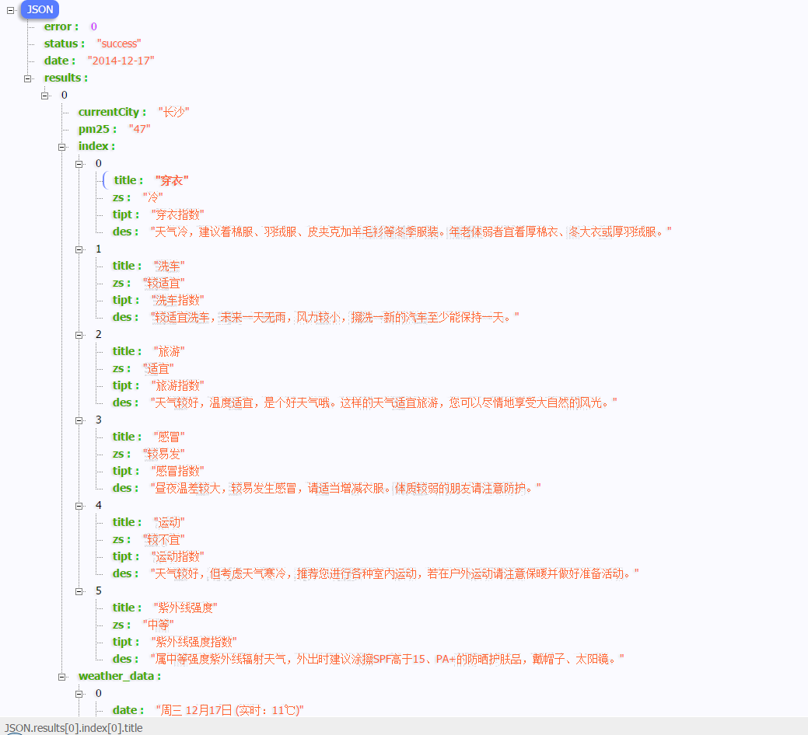
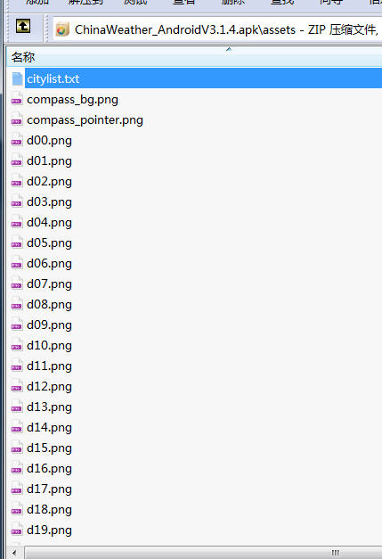
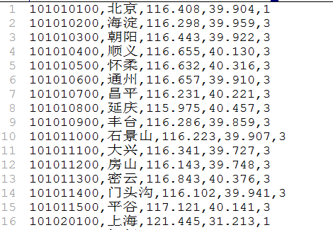
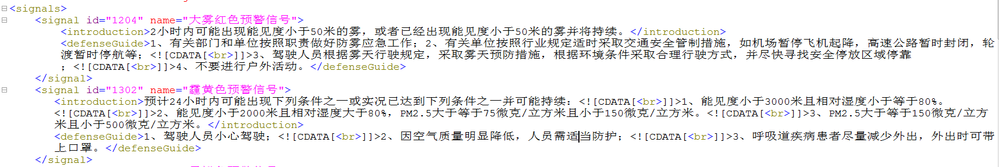

	
 返回的都是json数据

 [中国天气网_长沙](http://www.weather.com.cn/data/sk/101250101.html)

 示例链接  
 `
 http://www.weather.com.cn/data/sk/101250101.html
 `

 天气的另外还有一个百度的api 

 [baidu_changsha](http://api.map.baidu.com/telematics/v3/weather?location=%E9%95%BF%E6%B2%99&output=json&ak=640f3985a6437dad8135dae98d775a09)
 
 `http://api.map.baidu.com/telematics/v3/weather?location=%E9%95%BF%E6%B2%99&output=json&ak=640f3985a6437dad8135dae98d775a09
 `

中国天气网 城市列表文件、天气图标和其他资源文件

##### apk assets 文件列表 

##### 城市代码文件 

##### 特殊天气提示语 

相关文件下载：[weather_res.rar](../files/weather_res.rar)

