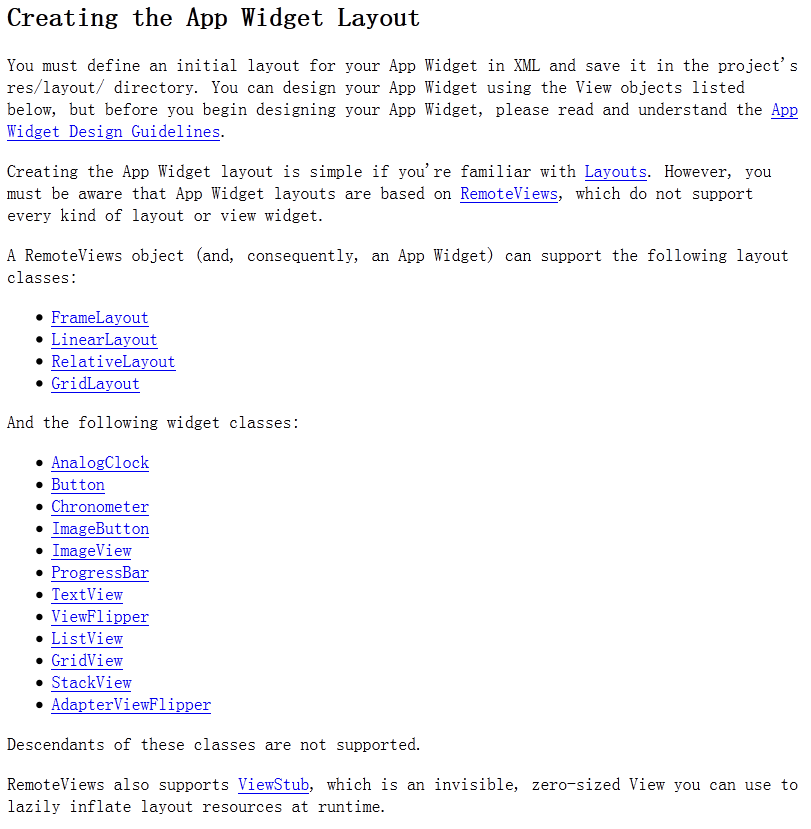

--
layout:post
title:自定义通知遇到的问题 Couldn't expand RemoteViews for StatusBarNotification
--

最近有个项目有需要自定义通知布局  在运行过程中出现如下错误

`android.app.RemoteServiceException: Bad notification posted from package com.example.androidtest: Couldn't expand RemoteViews for: StatusBarNotification(pkg=com.example.androidtest id=1714 tag=null score=0 notn=Notification(pri=0 contentView=com.example.androidtest/0x7f030024 vibrate=null sound=null defaults=0x0 flags=0x2 kind=[null]))`

google 找了很多  都没有解决方案  最终在官方api找到了相关解释

[http://developer.android.com/guide/topics/appwidgets/index.html#CreatingLayout](http://developer.android.com/guide/topics/appwidgets/index.html#CreatingLayout)

大概意思是RemoteView 只支持如下几种布局/控件  同时也支持 `ViewStub`
#### 布局
1. FrameLayout
2. LinearLayout
3. RelativeLayout
4. GridLayout 

#### 控件
1. AnalogClock
2. Button
3. Chronometer
4. ImageButton
5. ImageView
6. ProgressBar
7. TextView
8. ViewFlipper
9. ListView
10. GridView
11. StackView
12. AdapterViewFlipper

