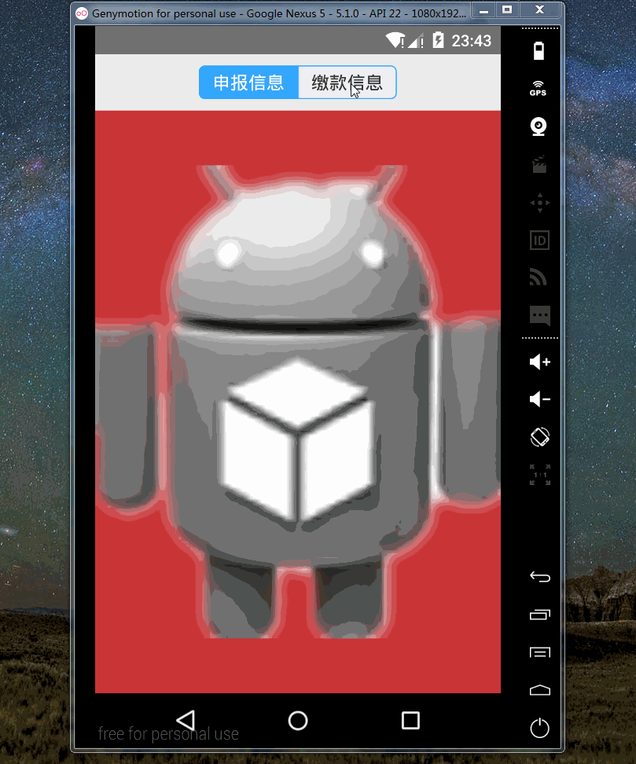

 近来在查看项目部分代码的时候，发现部分功能实现并不是那么完美，例如  可以使用 Tabhost 实现的却用了两个 Button 代替，布局也是 Layout 隐藏显示，没用用到 Fragment ，抽时间将代码进行了部分优化，同时发现，系统自带的 Tabhost 并不是辣么的完美，最好的方法是通过自定义 Tabhost 来进行相关实现，遂有了此文。

 先上效果图
 
 
 
 ###### Activity 

	 
	public class CusTabHostActivity extends BaseActivity implements OnTabChangeListener {
		
		private TabHost tabHost;
		private TabWidget tabWidget;
		private Button sbxxBtn, jkxxBtn;
		
		private final String TAG_SBXX = "sbxx";
		private final String TAG_JKXX = "jkxx";
		
		@Override
		protected void onCreate(Bundle savedInstanceState) {
			super.onCreate(savedInstanceState);
			setContentView(R.layout.cus_tab_host_layout);
			
			tabHost = (TabHost) findViewById(android.R.id.tabhost);
			tabHost.setup();
			tabHost.setOnTabChangedListener(this);
			
			tabWidget = (TabWidget) findViewById(android.R.id.tabs);
			
			initTab();
			
			addTab(TAG_SBXX, R.id.cus_tab_01, sbxxBtn);
			addTab(TAG_JKXX, R.id.cus_tab_02, jkxxBtn);
		}

		private void initTab() {
			sbxxBtn = (Button) getInflater().inflate(R.layout.cus_tab_layout, tabWidget, false);
			sbxxBtn.setBackgroundResource(R.drawable.sx_top_btn_bg_selector_right);
			sbxxBtn.setText("申报信息");
			
			jkxxBtn = (Button) getInflater().inflate(R.layout.cus_tab_layout, tabWidget, false);
			sbxxBtn.setBackgroundResource(R.drawable.sx_top_btn_bg_selector_left);
			jkxxBtn.setText("缴款信息");

			sbxxBtn.setEnabled(false);
			jkxxBtn.setEnabled(true);
		}
		
		private void addTab(String tag, int viewId, View view) {
			tabHost.addTab(tabHost.newTabSpec(tag).setContent(viewId).setIndicator(view));
		}

		@Override
		public void onTabChanged(String tabId) {
			if (tabId.equals(TAG_SBXX)) {
				sbxxBtn.setEnabled(false);
				jkxxBtn.setEnabled(true);
			}else {
				jkxxBtn.setEnabled(false);
				sbxxBtn.setEnabled(true);
			}
		}
	}

 ###### cus_tab_host_layout.xml 
 

  	<?xml version="1.0" encoding="utf-8"?>
	<TabHost xmlns:android="http://schemas.android.com/apk/res/android"
	    xmlns:tools="http://schemas.android.com/tools"
	    android:id="@android:id/tabhost"
	    android:layout_width="match_parent"
	    android:layout_height="match_parent" >

	    <LinearLayout
	        android:layout_width="match_parent"
	        android:layout_height="match_parent"
	        android:orientation="vertical" >
	        <TabWidget
	            android:id="@android:id/tabs"
	            android:divider="@color/sx_msg_change_bg" 
	            android:layout_width="wrap_content"
	            android:layout_height="30dp"
	            android:layout_marginTop="10dp"
	            android:layout_marginBottom="10dp"
	            android:layout_gravity="center" >
	        </TabWidget>

	        <FrameLayout
	            android:id="@android:id/tabcontent"
	            android:layout_width="match_parent"
	            android:layout_height="match_parent"
	            android:layout_weight="0"
	            android:background="@color/red" >

	            <LinearLayout
	                android:id="@+id/cus_tab_01"
	                android:layout_width="fill_parent"
	                android:layout_height="fill_parent"
	                android:orientation="vertical" >

	                <ImageView
	                    android:layout_width="fill_parent"
	                    android:layout_height="fill_parent"
	                    android:src="@drawable/ic_launcher_02" />
	            </LinearLayout>

	            <LinearLayout
	                android:id="@+id/cus_tab_02"
	                android:layout_width="fill_parent"
	                android:layout_height="fill_parent"
	                android:orientation="vertical" >

	                <ImageView
	                    android:layout_width="fill_parent"
	                    android:layout_height="fill_parent"
	                    android:src="@drawable/ic_launcher_01" />
	            </LinearLayout>
	        </FrameLayout>
	    </LinearLayout>
	</TabHost>

###### cus_tab_layout.xml   `此处注意：默认选择第一个，所有 style 默认为 right `

	<?xml version="1.0" encoding="utf-8"?>
	<Button xmlns:android="http://schemas.android.com/apk/res/android"
	    android:id="@+id/cus_tab_btn"
	    style="@style/sx_top_bg_right"  
	    android:layout_width="wrap_content"
	    android:layout_height="wrap_content"
	    android:text="申报信息" />

###### style & drawable & color  `此处 item 属性根据需求自行设置`

    

    

###### drawable/sx_top_btn_bg_selector_left.xml

	<?xml version="1.0" encoding="utf-8"?>
	<selector xmlns:android="http://schemas.android.com/apk/res/android">

	    <item android:state_enabled="false">
	        <shape>
	            <corners android:bottomLeftRadius="5dp" android:bottomRightRadius="0dp" android:topLeftRadius="5dp" android:topRightRadius="0dp" />

	            <solid android:color="@color/shuixin_voice_text" />

	            <stroke android:width="1dp" android:color="@color/shuixin_voice_text" />
	        </shape>
	    </item>
	    <item android:state_pressed="true">
	        <shape>
	            <corners android:bottomLeftRadius="5dp" android:bottomRightRadius="0dp" android:topLeftRadius="5dp" android:topRightRadius="0dp" />

	            <solid android:color="@color/shuixin_voice_text" />

	            <stroke android:width="1dp" android:color="@color/shuixin_voice_text" />
	        </shape>
	    </item>
	    <item>
	        <shape>
	            <corners android:bottomLeftRadius="5dp" android:bottomRightRadius="0dp" android:topLeftRadius="5dp" android:topRightRadius="0dp" />

	            <solid android:color="@color/sx_msg_change_bg" />

	            <stroke android:width="1dp" android:color="@color/shuixin_voice_text" />
	        </shape>
	    </item>

	</selector>

###### drawable/sx_top_btn_bg_selector_right.xml

	<?xml version="1.0" encoding="utf-8"?>
	<selector xmlns:android="http://schemas.android.com/apk/res/android">

	    <item android:state_enabled="false">
	        <shape>
	            <corners android:bottomLeftRadius="0dp" android:bottomRightRadius="5dp" android:topLeftRadius="0dp" android:topRightRadius="5dp" />

	            <solid android:color="@color/shuixin_voice_text" />

	            <stroke android:width="1dp" android:color="@color/shuixin_voice_text" />
	        </shape>
	    </item>
	    <item android:state_pressed="true">
	        <shape>
	            <corners android:bottomLeftRadius="0dp" android:bottomRightRadius="5dp" android:topLeftRadius="0dp" android:topRightRadius="5dp" />

	            <solid android:color="@color/shuixin_voice_text" />

	            <stroke android:width="1dp" android:color="@color/shuixin_voice_text" />
	        </shape>
	    </item>
	    <item>
	        <shape>
	            <corners android:bottomLeftRadius="0dp" android:bottomRightRadius="5dp" android:topLeftRadius="0dp" android:topRightRadius="5dp" />

	            <solid android:color="@color/sx_msg_change_bg" />

	            <stroke android:width="1dp" android:color="@color/shuixin_voice_text" />
	        </shape>
	    </item>

	</selector>

    <color name="shuixin_voice_text">#33a6ff</color>
    <color name="sx_msg_change_bg">#EFEFF4</color>

