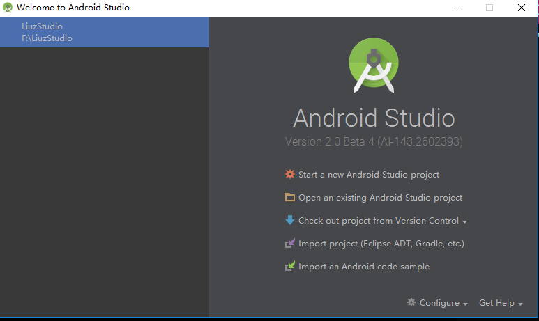

使用 Android Studio 已经有一段时间了，最近发现了个问题， `怎么 Android Studio 切换 Project?`  

就在刚刚，在给另外一台电脑安装 Studio 的时候，看到了安装完成后的启动界面，然后再对比自己电脑，发现了个问题
默认没有 Project 的时候，会显示启动界面，选择新建或者导入
如果已经有了 Project 且只有一个的时候，会默认选择，跳过启动界面直接进入主界面

那如何从主界面返回到启动界面呢？

单击 File 菜单，选择 close project 

好了，现在就回到了启动界面了，可以选择新建或者导入以及其他相关配置

此外，如果觉得一个 Project 中 Module 太多的，可以选择关闭部分

选择 Project 右键，选择 Open Project Structure (快捷键 F12)

在打开界面左侧 Modules中 选中要关闭的项目，点击左上角的减号，会弹出个对话框
看下内容，只是从 Project 移除 Module，并不会删除任何文件，点击 Yes 之后 Gradle 会重新 build

